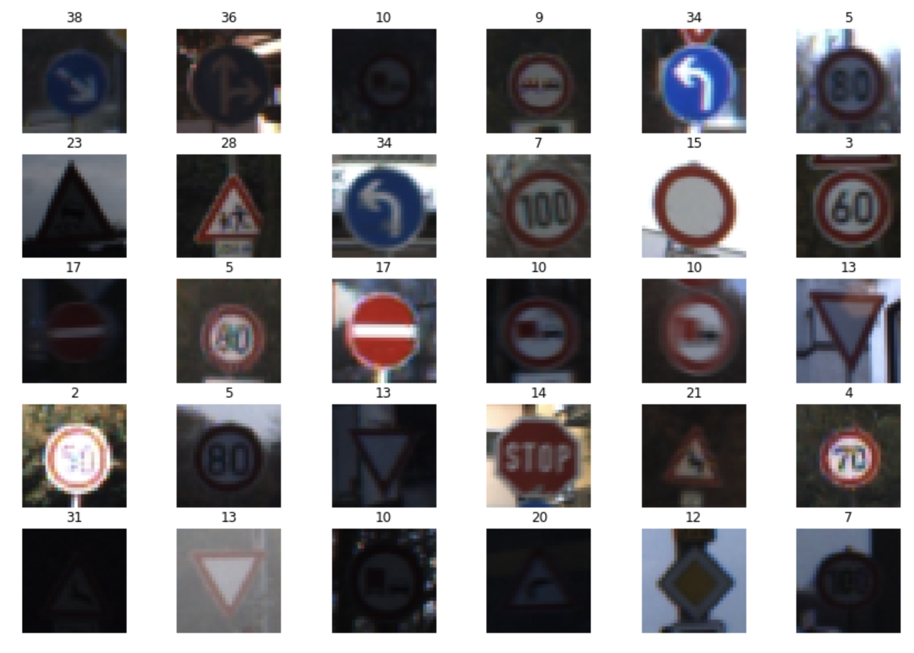
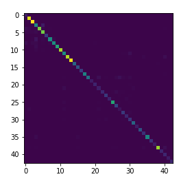
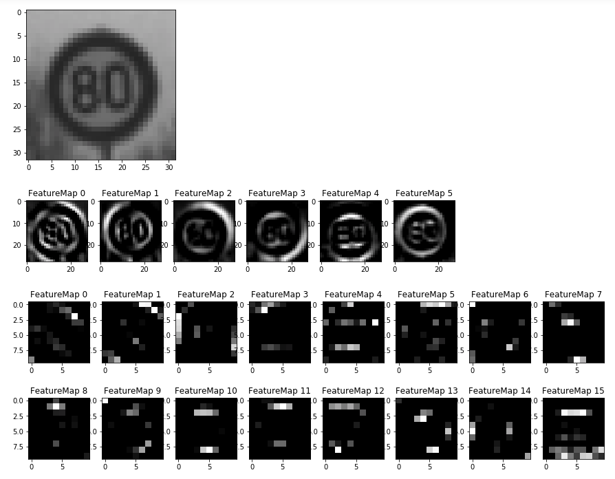

# **Traffic Sign Recognition**

## Writeup

### You can use this file as a template for your writeup if you want to submit it as a markdown file, but feel free to use some other method and submit a pdf if you prefer.

---

**Build a Traffic Sign Recognition Project**

The goals / steps of this project are the following:

* Load the data set (see below for links to the project data set)
* Explore, summarize and visualize the data set
* Design, train and test a model architecture
* Use the model to make predictions on new images
* Analyze the softmax probabilities of the new images
* Summarize the results with a written report

## Rubric Points
### Here I will consider the [rubric points](https://review.udacity.com/#!/rubrics/481/view) individually and describe how I addressed each point in my implementation.

---
### Writeup / README

#### 1. Provide a Writeup / README that includes all the rubric points and how you addressed each one. You can submit your writeup as markdown or pdf. You can use this template as a guide for writing the report. The submission includes the project code.

You're reading it! and here is a link to my [project code](https://github.com/glc12125/CarND-Traffic-Sign-Classifier-Project/blob/master/Traffic_Sign_Classifier.ipynb)

### Data Set Summary & Exploration

#### 1. Provide a basic summary of the data set. In the code, the analysis should be done using python, numpy and/or pandas methods rather than hardcoding results manually.

I used the pandas library to calculate summary statistics of the traffic
signs data set:

* The size of training set is 34799
* The size of the validation set is 4410
* The size of test set is 12630
* The shape of a traffic sign image is (32, 32, 3)
* The number of unique classes/labels in the data set is 43

#### 2. Include an exploratory visualization of the dataset.

Here is an exploratory visualization of the data set.

#### 3. Histogram of the traffic sign type distribution

##### Training dataset distribution

##### Validation dataset distribution

##### Testing dataset distribution

#### 4. Traffic sign ID-Type mapping

| ClassId        | Name           |
| :--------------: |:--------------:|
|0 | Speed limit (20km/h) |
|1 | Speed limit (30km/h) |
|2 | Speed limit (50km/h) |
|3 | Speed limit (60km/h) |
|4 | Speed limit (70km/h) |
|5 | Speed limit (80km/h) |
|6 | End of speed limit (80km/h) |
|7 | Speed limit (100km/h) |
|8 | Speed limit (120km/h) |
|9 | No passing |
|10 | No passing for vehicles over 3.5 metric tons |
|11 | Right-of-way at the next intersection |
|12 | Priority road |
|13 | Yield |
|14 | Stop |
|15 | No vehicles |
|16 | Vehicles over 3.5 metric tons prohibited |
|17 | No entry |
|18 | General caution |
|19 | Dangerous curve to the left |
|20 | Dangerous curve to the right |
|21 | Double curve |
|22 | Bumpy road |
|23 | Slippery road |
|24 | Road narrows on the right |
|25 | Road work |
|26 | Traffic signals |
|27 | Pedestrians |
|28 | Children crossing |
|29 | Bicycles crossing |
|30 | Beware of ice/snow |
|31 | Wild animals crossing |
|32 | End of all speed and passing limits |
|33 | Turn right ahead |
|34 | Turn left ahead |
|35 | Ahead only |
|36 | Go straight or right |
|37 | Go straight or left |
|38 | Keep right |
|39 | Keep left |
|40 | Roundabout mandatory |
|41 | End of no passing |
|42 | End of no passing by vehicles over 3.5 metric tons |

#### Traffic sign type occurence

Top 10:

Bottom 10:

### Design and Test a Model Architecture

#### 1. Describe how you preprocessed the image data. What techniques were chosen and why did you choose these techniques? Consider including images showing the output of each preprocessing technique. Pre-processing refers to techniques such as converting to grayscale, normalization, etc. (OPTIONAL: As described in the "Stand Out Suggestions" part of the rubric, if you generated additional data for training, describe why you decided to generate additional data, how you generated the data, and provide example images of the additional data. Then describe the characteristics of the augmented training set like number of images in the set, number of images for each class, etc.)

As a first step, I decided to convert the images to grayscale because I want the network to focus on shapes of the traffic signs, because light conditions can vary but shapes won't. Hence grayscale images are more reliable.

Here is an example of a traffic sign image before and after grayscaling.

As a last step, I normalized the image data because normalizing the features so that they are centered around 0 with a standard deviation of 1 is not only important if we are comparing measurements that have different units, but it is also a general requirement for many machine learning algorithms including deep learning. I normalized the traning images to be between (-1, 1). Here is an example:

I decided to generate additional data because some of the traffic signs have very small training dataset.

To add more data to the the data set, I used the following techniques:

1. Random translation
2. Random scaling
3. Random warp
4. Random light condition adjustment

These four transformation can be a practical way of reprensent how images can be taken differently. Therefore, without collecting more dataset by hand, we can obtain more dataset in a meaningful way.

Here is an example of an original image and an augmented image:

I only augmented images for those traffic signs that are fewer than 1000 training images. Here is the new distribution of the training set:

#### 2. Describe what your final model architecture looks like including model type, layers, layer sizes, connectivity, etc.) Consider including a diagram and/or table describing the final model.

My final model consisted of the following layers ([Network architecture adapted from the published model for GTSRB](http://yann.lecun.com/exdb/publis/pdf/sermanet-ijcnn-11.pdf)):

Here is the network architecture from the paper:

| ID | Layer         		|     Description	        					|
|:---------:|:---------------------:|:---------------------------------------------:|
| 0 | Input         		| 32x32x1 Gray scaled image   							|
| 1 | Convolution 5x5     	| 1x1 stride, valid padding, outputs 28x28x6 	|
| 2 | RELU					|												|
| 3 | Max pooling	      	| 2x2 stride,  outputs 14x14x6  				|
| 4 | Convolution 5x5     	| 1x1 stride, valid padding, outputs 10x10x16 	|
| 5 | RELU					|												|
| 6 | Max pooling	      	| 2x2 stride,  outputs 5x5x16  					|
| 7 | Convolution 5x5     	| 1x1 stride, valid padding, outputs 1x1x400 	|
| 8 | RELU					|												|
| 9 | Flatten				| input ID 7, outputs 400 						|
| 10 | Flatten				| input ID 8, outputs 400 						|
| 11 | Concatenate 			| input ID 10 and 11, outputs 800 				|
| 12 | Dropout 				| 								 				|
| 13 | Fully connected		| outputs 43        							|

#### 3. Describe how you trained your model. The discussion can include the type of optimizer, the batch size, number of epochs and any hyperparameters such as learning rate.

To train the model, I used AdamOptimizer, a batch size of 100, at most 50 epochs, a learn rate of 0.001. Another hyperparameter was the dropout rate which was 0.5 at layer 13. These hyperparameters generate the best accuracy so far. I saved the model which had the best validation accuracy.

#### 4. Describe the approach taken for finding a solution and getting the validation set accuracy to be at least 0.93. Include in the discussion the results on the training, validation and test sets and where in the code these were calculated. Your approach may have been an iterative process, in which case, outline the steps you took to get to the final solution and why you chose those steps. Perhaps your solution involved an already well known implementation or architecture. In this case, discuss why you think the architecture is suitable for the current problem.

##### My final model results were:
* training set accuracy of 100%
* validation set accuracy of 96.4%
* test set accuracy of 94.6%

##### Here is the precision and recalls for each traffic sign type:

##### Here is the confusion matrix:

### Test a Model on New Images

#### 1. Choose five German traffic signs found on the web and provide them in the report. For each image, discuss what quality or qualities might be difficult to classify.

Here are five German traffic signs that I found on the web:

Apart from the roundabout traffic sign, all the other signs have challenging effects: the pedestrian one has a colored background, the ice one literally is covered by ice, both the stop sign and the yield sign are translated in some degrees.

#### 2. Discuss the model's predictions on these new traffic signs and compare the results to predicting on the test set. At a minimum, discuss what the predictions were, the accuracy on these new predictions, and compare the accuracy to the accuracy on the test set (OPTIONAL: Discuss the results in more detail as described in the "Stand Out Suggestions" part of the rubric).

Here are the results of the prediction:

| Image			        |     Prediction	        					|
|:---------------------:|:---------------------------------------------:|
| Priority      		| Priority   									|
| Stop Sign     		| Stop Sign 									|
| Pedestrian			| Speed limit (80km/h)	     					|
| Yield					| Yield											|
| Ice	      			| Slippery Road					 						|

The model was able to correctly guess 4 of the 5 traffic signs, which gives an accuracy of 60%.

#### 3. Describe how certain the model is when predicting on each of the five new images by looking at the softmax probabilities for each prediction. Provide the top 5 softmax probabilities for each image along with the sign type of each probability. (OPTIONAL: as described in the "Stand Out Suggestions" part of the rubric, visualizations can also be provided such as bar charts)

The code for making predictions on my final model is located in the 55th and 56th cells of the Ipython notebook.

The following is the list of how the model is confident about its prediction for each new testing image:

### (Optional) Visualizing the Neural Network (See Step 4 of the Ipython notebook for more details)
#### 1. Discuss the visual output of your trained network's feature maps. What characteristics did the neural network use to make classifications?

Here is the feature maps of first two convolution layers:

As I can see from above, the first layer, captures the invariant shapes and structures of the speed limit 80 traffic sign. FeatureMap0 and FeatureMap1 capture the figure 80 quite clearly, while FeatureMap2 focuses on the outer round shape of the sign. The second convolutional layer looks at the features at more detailed level. FeatureMap2 sees vertical lines while FeatureMap4 only cares about horizontal lines. Therefore, the baseline model proposes to concatenate the first layer directly with the second convolutionaly layer so that the classifier gets both scales of receptive fields. This proves to yield higher accuracy.
